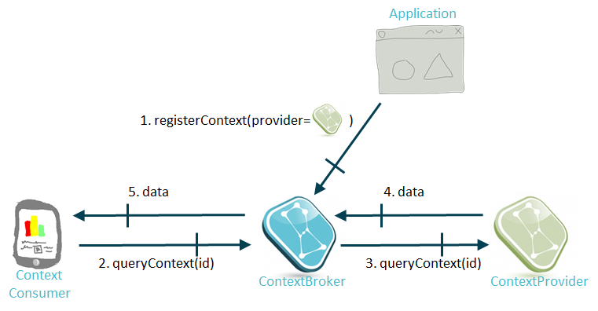

# Context Providers registration and request forwarding

The register context operation (both in
[standard](walkthrough_apiv1.md#register-context-operation) and [convenience](walkthrough_apiv1.md#convenience-register-context) cases) uses a
field named "providing application" which is a URL that identifies the
source of the context information for the entities/attributes included
in that registration. We call that source the "Context Provider" (or
CPr, for short).

     ...
     "providingApplication" : "http://mysensors.com/Rooms"
     ...
  
If Orion receives a query or update operation (either in the standard or
in the convenience family) and it cannot find the targeted context
element locally (i.e. in its internal database) *but* a Context Provider
is registered for that context element, then Orion will forward the
query/update request to the Context Provider. In this case, Orion acts
as a pure "NGSI proxy" (i.e. doesn't cache the result of the query
internally) and, from the point of view of the client issuing the
original request, the process is mostly transparent. The Context
Provider is meant to implement the NGSI10 API (at least partially) to
support the query/update operation.

Let's illustrate this with an example.




-     First (message number 1), the application (maybe on behalf of a
      Context Provider) registers the Context Provider at Orion for the
      Street4 temperature. Let's assume that the Context Provider exposes
      its API on <http://sensor48.mycity.com/v1>
      
```
(curl localhost:1026/v1/registry/registerContext -s -S --header 'Content-Type: application/json' \
    --header 'Accept: application/json' -d @- | python -mjson.tool) <<EOF
{
    "contextRegistrations": [
        {
            "entities": [
                {
                    "type": "Street",
                    "isPattern": "false",
                    "id": "Street4"
                }
            ],
            "attributes": [
                {
                    "name": "temperature",
                    "type": "float",
                    "isDomain": "false"
                }
            ],
            "providingApplication": "http://sensor48.mycity.com/v1"
        }
    ],
    "duration": "P1M"
}
EOF
```
      
      
-     Next, consider that a client queries the Street4 temperature
      (message number 2).

      
``` 
(curl localhost:1026/v1/queryContext -s -S --header 'Content-Type: application/json' \
    --header 'Accept: application/json' -d @- | python -mjson.tool) <<EOF
{
    "entities": [
        {
            "type": "Street",
            "isPattern": "false",
            "id": "Street4"
        }
    ],
    "attributes": [
        "temperature"
    ]
}
EOF
``` 


-     Orion doesn't know the Street 4 temperature, but it knows (due to
      the registration in the previous step) that the Context Provider at
      <http://sensor48.mycity.com/v1> knows that, so it forwards the query
      (message number 3) to the URL
      <http://sensor48.mycity.com/v1/queryContext> (i.e. the URL used in
      the Providing Application field at registration time, plus the
      "/queryContext" operation).


``` 
{
    "entities": [
        {
            "type": "Street",
            "isPattern": "false",
            "id": "Street4"
        }
    ],
    "attributes": [
        "temperature"
    ]
}
``` 


-     The Context Provider at <http://sensor48.mycity.com/v1> responds
      with the data (message number 4).

``` 
{
    "contextResponses": [
        {
            "contextElement": {
                "attributes": [
                    {
                        "name": "temperature",
                        "type": "float",
                        "value": "16"
                    }
                ],
                "id": "Street4",
                "isPattern": "false",
                "type": "Street"
            },
            "statusCode": {
                "code": "200",
                "reasonPhrase": "OK"
            }
        }
    ]
}
``` 

-     Orion fordwars the response to the client (message number 5). Note
      that the response is not exactly the same, as it includes a
      reference to the Context Provider that has resolved it (that's why
      it is said that "the process is *mostly* transparent" instead of
      "the process is *completely* transparent"). The client can use
      (or ignore) that information. Orion doesn't store the
      Street4 temperature.
 
``` 
{
    "contextResponses": [
        {
            "contextElement": {
                "attributes": [
                    {
                        "name": "temperature",
                        "type": "float",
                        "value": "16"
                    }
                ],
                "id": "Street4",
                "isPattern": "false",
                "type": "Street"
            },
            "statusCode": {
                "code": "200",
                "details": "Redirected to context provider http://sensor48.mycity.com/v1",
                "reasonPhrase": "OK"
            }
        }
    ]
}
``` 
  
The Context Providers and request forwarding functionality was developed
in release 0.15.0. Previous version
of Orion Context Broker just stores this field in the database. Thus,
applications can access the Providing Application using the [discover
context availability operation](walkthrough_apiv1.md#discover-context-availability-operation) and do
whatever they want with it. This is typically the case when the Orion
Context Broker is used just as a repository for NGSI9 registrations, but
the actual management of context information is done by other components
of the architecture. Although current versions support Context Providers
and request forwarding functionaly, nothing precludes you from using
Orion also in that way.

Some additional comments:

-   The `-httpTimeout` [CLI parameter](admin/cli.md)
    is used to set the CPr timeout. If a request forwarded to a CPr is
    taking more that that timeout, then Orion closes the connection and
    assumes that the CPr is not responding.
-   In the case a given
    request involves more than one Context Provider (e.g. an
    updateContext including 3 context elements, each one being an entity
    managed by a different Context Provider), Orion will forward the
    corresponding "piece" of the request to each Context Provider,
    gathering all the results before responding to the client. Current
    implementation process multiple forwards in sequence, i.e. waiting
    the response from a given CPr (or timeout expiration) before sending
    the forward request to the following.
-   You can use the `-cprForwardLimit` [CLI parameter](admin/cli.md) to limit
    the maximum number of forwarded requests to Context Providers for a single client request.
    You can use 0 to disable Context Providers forwarding at all.
-   In NGSIv1 registrations, `isPattern` cannot be set to `"true"`.
    If so, the registration fails and an error is returned.
    The OMA specification allows for regular expressions in entity id in registrations but as of now,
    the Context Broker doesn't support this feature.
